# A Flask App demonstrating Register/Login functionality

_Bcrypt library is used for password hashing besides incorporating a salt to protect against rainbow table attacks, bcrypt is an adaptive function: over time, the iteration count can be increased to make it slower, so it remains resistant to brute-force search attacks even with increasing computation power._

## Home Page

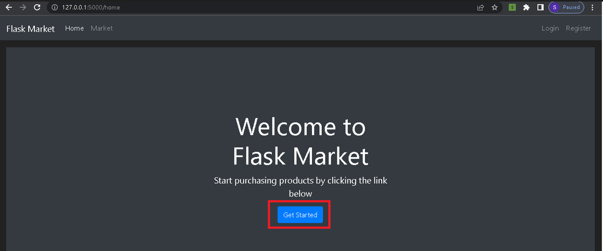

## Login and Register Page

If the user already has an account then he/she can directly login else click on _Register_ CTA.

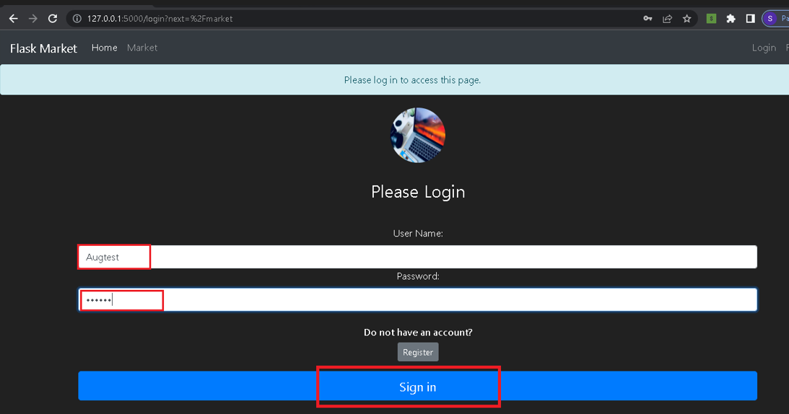

User enters username, email, password and click on _Create Account_

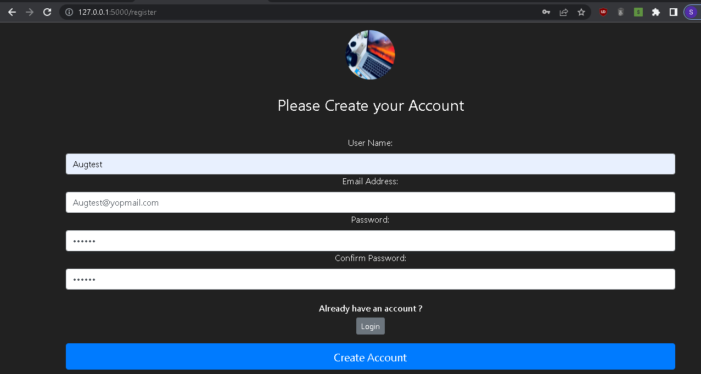

## Market Landing Page

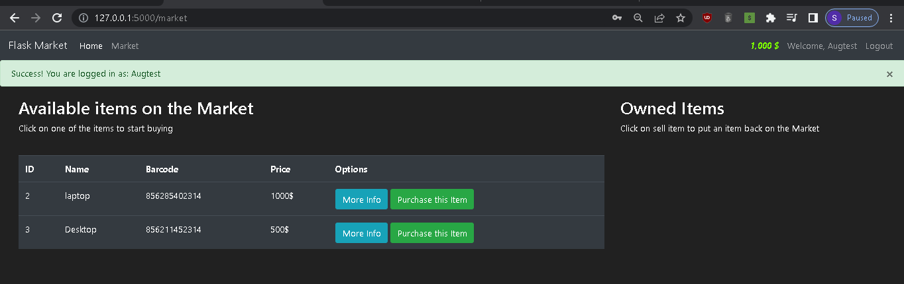

## Purchasing an item from Market

User clicks on _Purchase this item_ CTA and purchases an item
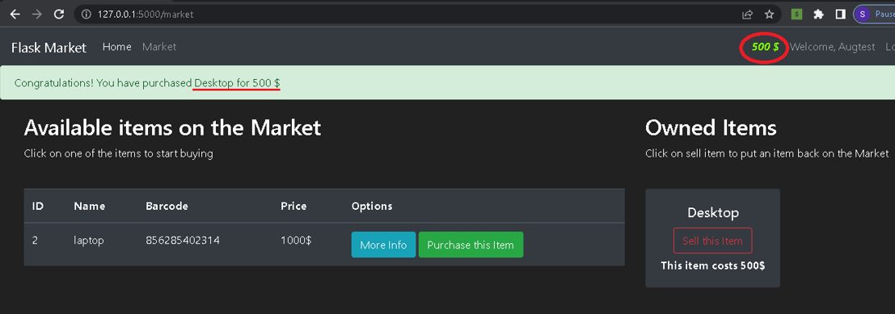

## Selling back an item

User clicks on _Sell this item_ CTA,the item is sold back to the market and the price is updated in the account, when the user clicks on logout then he/she is redirected to home page.
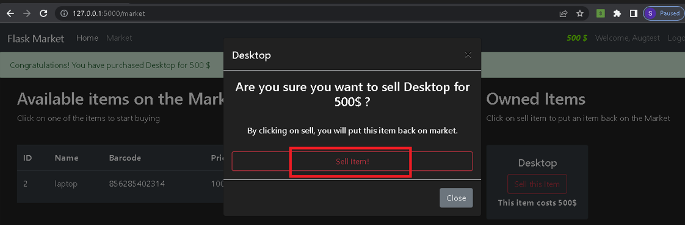

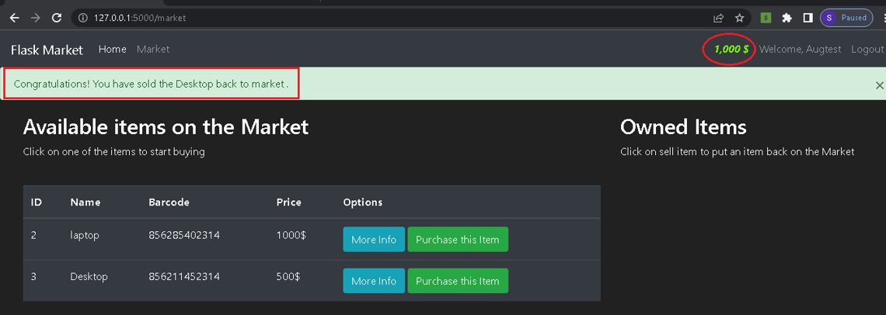

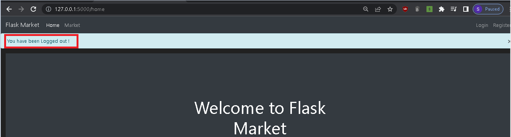

## Some checks performed

- User enters incorrect password while registration
  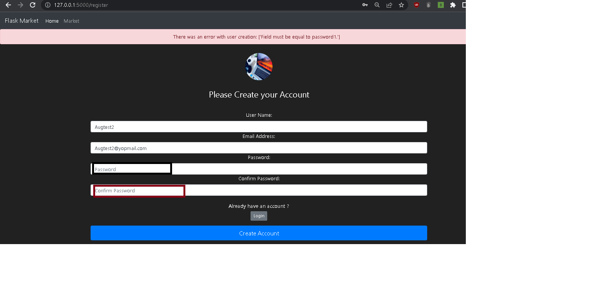

- Existing user trying to create a new account using same data
  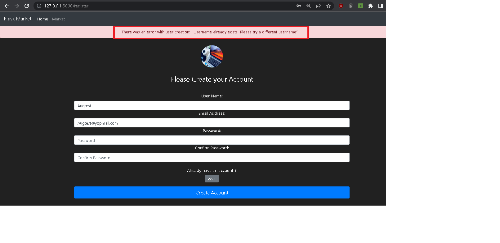

- User enters incorrect username or password on login page
  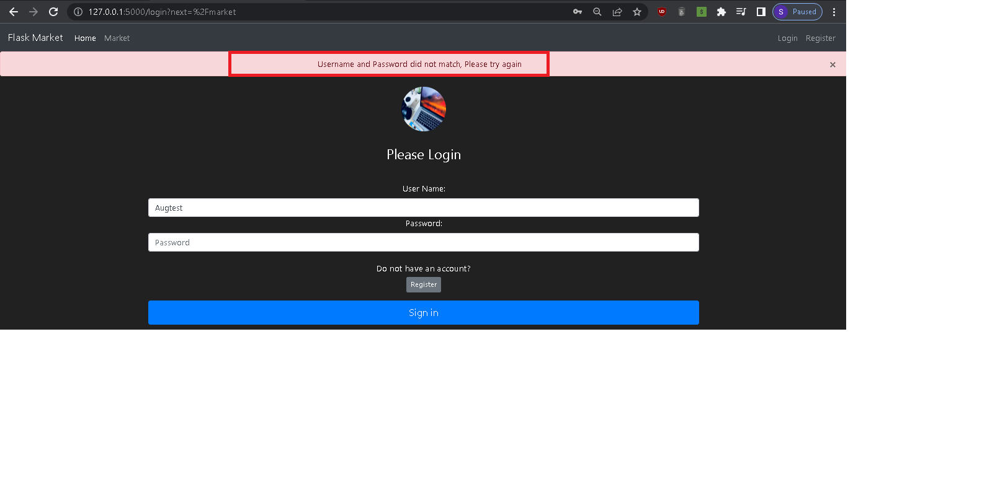

---

## 🔗 Links

